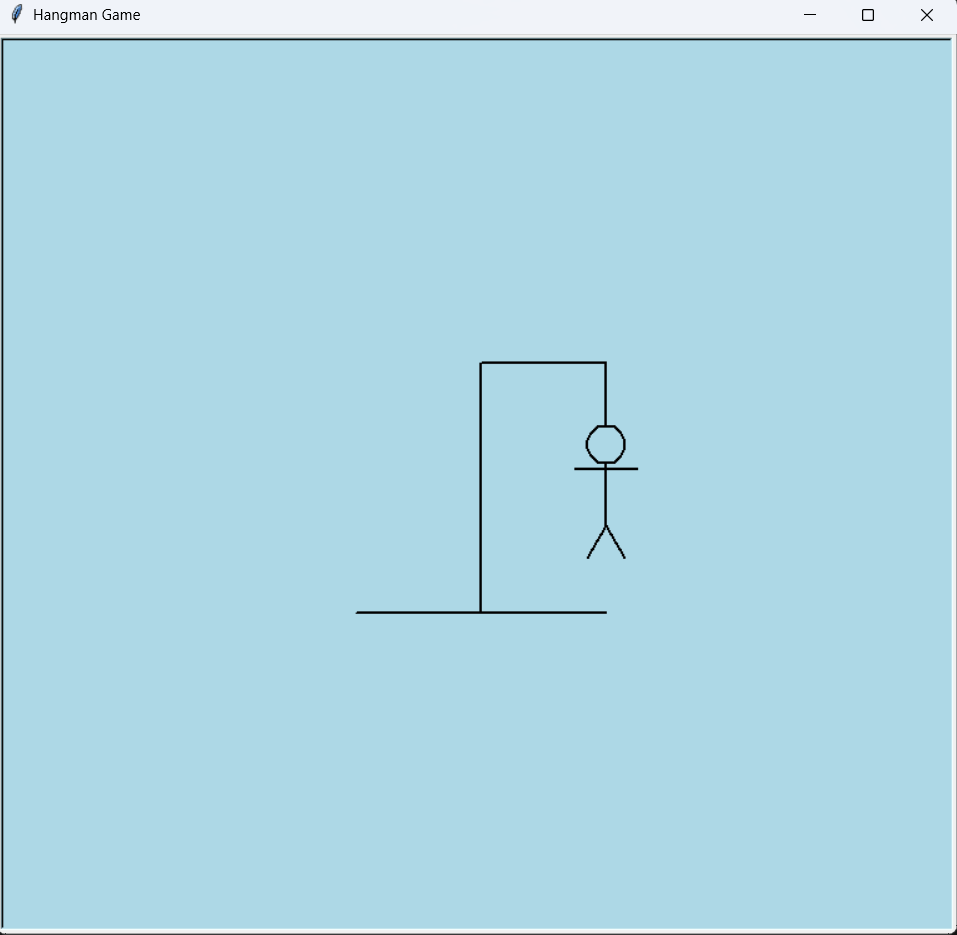

# Hangman Game with Python Turtle

This project is a graphical implementation of the classic Hangman game, developed using Python's turtle library. The application features real-time drawing of the character based on user input and logic handling for word guessing.

## Gameplay and Visuals

Below is a screenshot from the application:



## Technical Overview

The project is structured with a focus on modular programming and coordinate-based graphics:

* **Graphics Engine:** Utilizes the built-in turtle module for vector-based drawing.
* **Game Logic:** Dynamic word selection using the random module.
* **Input Validation:** Handles non-alphabetic characters and repeated guesses.
* **State Management:** Tracks wrong guesses to update the hangman progression.

## How to Run

To run the project on a local machine, follow these steps:

1. Clone this repository to your computer.
2. Ensure Python is installed.
3. Run the script from your terminal or IDE:
   ```bash
   python hangman.py

   Gemini şunu dedi:
Anladım, hiçbir ek açıklama olmadan, sadece kopyalayıp GitHub'daki README.md dosyasına yapıştırabileceğin tam metni aşağıda hazırladım.

Resminin adının GitHub'da image.png olduğunu varsayarak hazırladım, bu sayede yapıştırdığın an resim otomatik olarak görünecek.

Markdown
# Hangman Game with Python Turtle

This project is a graphical implementation of the classic Hangman game, developed using Python's turtle library. The application features real-time drawing of the character based on user input and logic handling for word guessing.

## Gameplay and Visuals

Below is a screenshot from the application:


## Technical Overview

The project is structured with a focus on modular programming and coordinate-based graphics:

* **Graphics Engine:** Utilizes the built-in turtle module for vector-based drawing.
* **Game Logic:** Dynamic word selection using the random module.
* **Input Validation:** Handles non-alphabetic characters and repeated guesses.
* **State Management:** Tracks wrong guesses to update the hangman progression.

## How to Run

To run the project on a local machine, follow these steps:

1. Clone this repository to your computer.
2. Ensure Python is installed.
3. Run the script from your terminal or IDE:
   ```bash
   python hangman.py

   
About the Project
This project was developed at Beykent University as part of my Computer Engineering studies to demonstrate Python GUI development and algorithm design.

